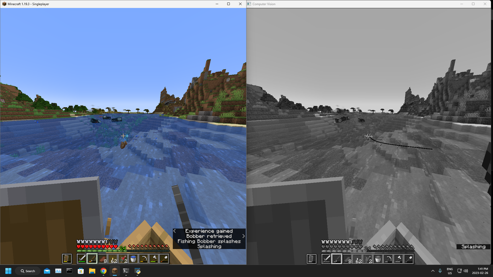

# Minecraft Fishing Bot

A bot that can automatualy fish in Minecraft.



## Instructions

### Install Tesseract

The fishing bot depends on Tesseract, which is an optical character recognition (OCR) engine that is used to convert scanned images of machine-printed and handwritten text into digital text. You can find the latest version [here](https://github.com/UB-Mannheim/tesseract/wiki).

Make sure to specify the path to "tesseract.exe" in "main.py".

### Install Dependencies

Install the necessary dependencies.

```python
pip install -r requirements.txt
```

### Things To Note

Subtitles need to be turned on for it to work.

It dosent work in full screen.

Set keyboard focus on the computer vision window and press "q" to quit.

It is buggy when multiple people are fishing in the same spot.

It is still a work in progress.
